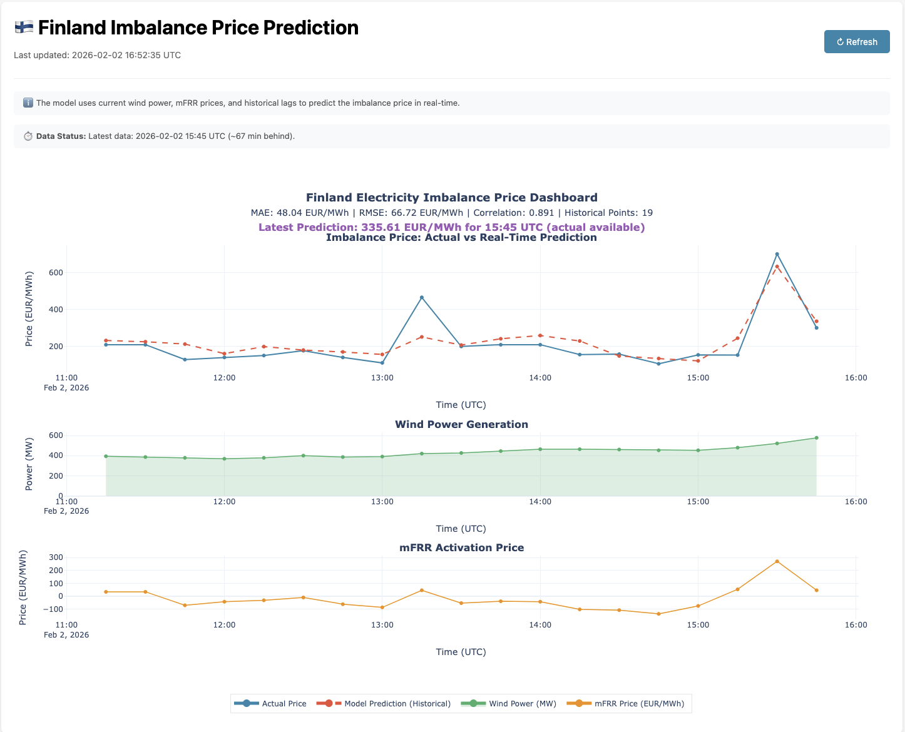
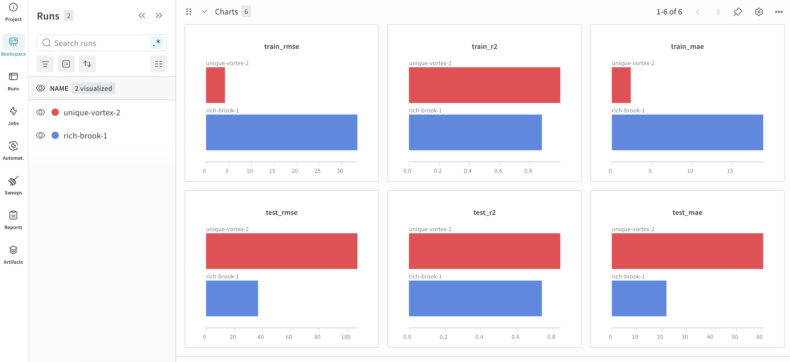

# Vattenfall MLOps

Real-time electricity imbalance price prediction service for Finland, featuring automated MLOps with DLT data ingestion, champion/challenger model promotion, and Azure Container Apps deployment.

## 🌐 Live Service

**Production URL**: https://vattenfall-mlops-app.niceriver-dbaaae1a.northeurope.azurecontainerapps.io

| Endpoint | Description |
|----------|-------------|
| [`/docs`](https://vattenfall-mlops-app.niceriver-dbaaae1a.northeurope.azurecontainerapps.io/docs) | FastAPI interactive API docs |
| [`/health`](https://vattenfall-mlops-app.niceriver-dbaaae1a.northeurope.azurecontainerapps.io/health) | Health check & model status |
| [`/predict`](https://vattenfall-mlops-app.niceriver-dbaaae1a.northeurope.azurecontainerapps.io/predict) | Real-time price prediction |
| [`/model/info`](https://vattenfall-mlops-app.niceriver-dbaaae1a.northeurope.azurecontainerapps.io/model/info) | Current model version from W&B |
| [`/dashboard`](https://vattenfall-mlops-app.niceriver-dbaaae1a.northeurope.azurecontainerapps.io/dashboard) | Interactive data visualization |


<b>Interactive Dashboard</b>



</details>

---

## 🏗️ Architecture

```
┌────────────────────────────────────────────────────────────────────────────────────────────┐
│                                    GITHUB ACTIONS CI/CD                                    │
│                                                                                            │
│   ┌──────────┐     ┌──────────┐     ┌──────────┐     ┌──────────┐     ┌──────────┐         │
│   │  Ingest  │────▶│ Features │────▶│  Train   │────▶│ Promote  │     │  Deploy  │         │
│   │ (hourly) │     │          │     │          │     │          │     │ (on push)│         │
│   └──────────┘     └──────────┘     └──────────┘     └──────────┘     └──────────┘         │
│        │                │                │                │                │               │
└────────┼────────────────┼────────────────┼────────────────┼────────────────┼───────────────┘
         │                │                │                │                │
         ▼                ▼                ▼                ▼                ▼
┌────────────────────────────────────────────────────────────────────────────────────────────┐
│                                     DATA & MODEL LAYER                                     │
│                                                                                            │
│   ┌──────────────┐         ┌──────────────────┐         ┌──────────────────────┐           │
│   │  Fingrid API │         │  Azure Blob      │         │  W&B Model Registry  │           │
│   │              │         │  Storage         │         │                      │           │
│   │ • Wind #181  │   DLT   │                  │         │  imbalance-price-    │           │
│   │ • mFRR #342. │────────▶│  raw/fingrid/    │         │  model               │           │
│   │ • Price#319  │         │    ├─ wind/      │         │                      │           │
│   │              │         │    ├─ mfrr/      │         │  ┌────────┐          │           │
│   └──────────────┘         │    └─ imbalance/ │         │  │   v0   │ archived │           │
│                            │                  │         │  ├────────┤          │           │
│                            │  features/       │         │  │   v1   │ archived │           │
│                            │    └─ merged.pq  │         │  ├────────┤          │           │
│                            └──────────────────┘         │  │   v2   │◀─ prod   │           │
│                                     │                   │  └────────┘          │           │
│                                     │                   └──────────────────────┘           │
│                                     │                            │                         │
└─────────────────────────────────────┼────────────────────────────┼─────────────────────────┘
                                      │                            │
                                      │ reads features             │ loads production model
                                      ▼                            ▼
┌────────────────────────────────────────────────────────────────────────────────────────────┐
│                              AZURE CONTAINER APPS (North Europe)                           │
│                                                                                            │
│   ┌──────────────────────────────────────────────────────────────────────────────────┐     │
│   │                      FastAPI Prediction Service                                  │     │
│   │                                                                                  │     │
│   │   ┌──────────┐   ┌──────────┐   ┌──────────┐   ┌─────────────┐   ┌───────────┐   │     │
│   │   │ /health  │   │ /predict │   │/dashboard│   │ /model/info │   │   /docs   │   │     │
│   │   └──────────┘   └──────────┘   └──────────┘   └─────────────┘   └───────────┘   │     │
│   │                                                                                  │     │
│   │   • Auto-scaling: 0-3 replicas    • Model loaded from W&B at startup             │     │
│   │   • CPU: 0.5 cores | RAM: 1Gi     • Hot-reload on container restart              │     │
│   └──────────────────────────────────────────────────────────────────────────────────┘     │
│                                                                                            │
│   ┌─────────────┐    ┌─────────────┐    ┌─────────────┐    ┌─────────────┐                 │
│   │     ACR     │    │  Key Vault  │    │  Identity   │    │    Logs     │                 │
│   │   Images    │    │   Secrets   │    │   (RBAC)    │    │  Analytics  │                 │
│   └─────────────┘    └─────────────┘    └─────────────┘    └─────────────┘                 │
└────────────────────────────────────────────────────────────────────────────────────────────┘
```

### MLOps Pipeline Flow

| Stage | Trigger | Description |
|-------|---------|-------------|
| **1. Ingest** | Hourly cron | DLT fetches new data from Fingrid API → Azure Blob Storage |
| **2. Features** | After ingest | Processes raw data → creates 42 ML features |
| **3. Train** | After features | Trains challenger model → registers to W&B as `staging` |
| **4. Promote** | After train | Compares staging vs production MAE → promotes if better |
| **5. Deploy** | Push to main | Builds container → deploys to Azure Container Apps |

### Champion/Challenger Model Promotion

```
┌─────────────────────────────────────────────────────────────────────────┐
│                     Automated Model Promotion                           │
│                                                                         │
│   Staging Model (Challenger)          Production Model (Champion)       │
│   ┌─────────────────────┐             ┌─────────────────────┐           │
│   │ imbalance-price-    │             │ imbalance-price-    │           │
│   │ model:staging       │             │ model:production    │           │
│   │                     │   Compare   │                     │           │
│   │ MAE: 25.57          │────────────▶│ MAE: 25.65          │           │
│   │ R²:  0.8078         │             │ R²:  0.8014         │           │
│   └─────────────────────┘             └─────────────────────┘           │
│            │                                    │                       │
│            │         ┌─────────────────┐        │                       │
│            └────────▶│ MAE Improved!   │◀───────┘                       │
│                      │ Promote staging │                                │
│                      │ → production    │                                │
│                      └─────────────────┘                                │
└─────────────────────────────────────────────────────────────────────────┘
```
[Weights & Biases Model Registry](https://wandb.ai/joelaftreth-independent/vattenfall-imbalance-price/)



</details>

**Promotion Rules:**
- ✅ Challenger MAE ≤ Champion MAE (lower is better)
- ✅ Challenger R² not regressed by more than 5%

---

## 📡 API Usage

### Health Check

```bash
curl https://vattenfall-mlops-app.niceriver-dbaaae1a.northeurope.azurecontainerapps.io/health
```

**Response:**
```json
{
  "status": "healthy",
  "model_loaded": true,
  "model_features": 44,
  "timestamp": "2026-02-02T18:05:24.498798Z"
}
```

### Model Info

```bash
curl https://vattenfall-mlops-app.niceriver-dbaaae1a.northeurope.azurecontainerapps.io/model/info
```

**Response:**
```json
{
  "model_version": "v2",
  "model_source": "wandb_registry",
  "features_count": 42
}
```

### Get Prediction

```bash
curl https://vattenfall-mlops-app.niceriver-dbaaae1a.northeurope.azurecontainerapps.io/predict
```

**Response:**
```json
{
  "predicted_price": 73.73,
  "unit": "EUR/MWh",
  "prediction_for": "2026-02-02T17:15:00Z",
  "data_timestamp": "2026-02-02T17:00:00Z",
  "model_version": "v2"
}
```

---

## 📁 Project Structure

```
vattenfall-mlops/
├── app/                    # FastAPI application
│   ├── main.py            # API endpoints (/health, /predict, /dashboard, /model/info)
│   └── schemas.py         # Pydantic request/response models
├── pipeline/              # MLOps pipeline modules
│   ├── ingest.py          # DLT data ingestion to Azure Blob
│   ├── features.py        # Feature engineering from raw data
│   ├── train.py           # Model training + W&B registry
│   └── promote.py         # Champion/challenger promotion
├── ingestion/             # Data utilities
│   ├── client.py          # Fingrid API client
│   ├── processor.py       # Feature transformation functions
│   └── dlt_source.py      # DLT incremental source
├── scripts/               # Automation scripts
│   └── setup_azure.sh     # Azure SP + Terraform bootstrap
├── infra/                 # Terraform IaC
│   ├── main.tf            # Container Apps, ACR
│   ├── storage.tf         # Azure Blob Storage
│   ├── security.tf        # Key Vault, managed identity
│   └── outputs.tf         # Deployment outputs
├── .github/workflows/     # CI/CD pipelines
│   ├── ingest.yml         # Hourly data ingestion
│   ├── features.yml       # Feature generation (after ingest)
│   ├── train.yml          # Model training (after features)
│   ├── promote.yml        # Model promotion (after train)
│   └── deploy.yml         # Azure deployment (on push)
├── notebooks/             # Jupyter notebooks
│   ├── eda.ipynb          # Exploratory data analysis
│   └── training_results.ipynb # Model development and evaluation
├── docs/                  # Documentation
│   ├── project_plan.md    # Development roadmap
│   └── screenshots/       # Dashboard, W&B, API docs images
├── Dockerfile             # Container image definition
├── pyproject.toml         # Python dependencies (uv)
└── .env.example           # Environment template
```

---

## 🚀 Quick Start

### Prerequisites

| Tool | Installation | Purpose |
|------|--------------|---------|
| uv | `curl -LsSf https://astral.sh/uv/install.sh \| sh` | Python package manager |
| Azure CLI | `brew install azure-cli` | Azure authentication |
| Terraform | `brew install terraform` | Infrastructure as Code |
| Docker | [docker.com](https://docker.com) | Container builds |

### 1. Clone & Setup

```bash
git clone https://github.com/jja4/vattenfall-mlops.git
cd vattenfall-mlops

# Install dependencies
uv sync

# Create environment file
cp .env.example .env
# Edit .env with your API keys
```

### 2. Bootstrap Azure Infrastructure

```bash
# Login to Azure
az login

# Run bootstrap script (creates SP, runs Terraform, outputs secrets)
./scripts/setup_azure.sh

# Or with GitHub secrets auto-configuration
./scripts/setup_azure.sh --set-github-secrets
```

### 3. Run Pipeline Locally

```bash
# Ingest data from Fingrid API → Azure Blob
uv run python -m pipeline.ingest

# Generate features
uv run python -m pipeline.features

# Train model → registers to W&B as staging
uv run python -m pipeline.train

# Promote to production (if better)
uv run python -m pipeline.promote
```

### 4. Run API Locally

```bash
# Start FastAPI server
uv run uvicorn app.main:app --reload --port 8000

# Test endpoints
curl http://localhost:8000/health
curl http://localhost:8000/predict
open http://localhost:8000/dashboard
```

---

## ⚙️ Configuration

### Environment Variables

| Variable | Required | Description |
|----------|----------|-------------|
| `FINGRID_API_KEY` | Yes | API key from [Fingrid Open Data](https://data.fingrid.fi/) |
| `WANDB_API_KEY` | Yes | Weights & Biases for model registry |
| `AZURE_STORAGE_CONNECTION_STRING` | Yes | Azure Blob Storage for DLT data |
| `USE_WANDB_REGISTRY` | No | Load model from W&B (default: true in prod) |

### GitHub Secrets (for CI/CD)

| Secret | Purpose |
|--------|---------|
| `ARM_CLIENT_ID` | Azure Service Principal |
| `ARM_CLIENT_SECRET` | Azure SP secret |
| `ARM_SUBSCRIPTION_ID` | Azure subscription |
| `ARM_TENANT_ID` | Azure AD tenant |
| `FINGRID_API_KEY` | Fingrid API authentication |
| `WANDB_API_KEY` | W&B model registry access |
| `AZURE_STORAGE_CONNECTION_STRING` | DLT data storage |

---

## 📊 Model Details

| Property | Value |
|----------|-------|
| **Algorithm** | GradientBoostingRegressor |
| **Features** | 42 engineered features |
| **Target** | Imbalance price (EUR/MWh) |
| **Training Data** | 365 days of Fingrid data |
| **Registry** | W&B Model Registry |
| **Current Version** | v2 (production) |

### Feature Categories

- **Lag features**: 1h, 2h, 3h, 6h, 12h, 24h historical values
- **Rolling statistics**: Mean, std, min, max over 1h-24h windows
- **Temporal encoding**: Hour-of-day (cyclical), day-of-week
- **Cross-features**: Wind-price interaction, volatility measures

### Top 10 Important Features

1. `price_rolling_1h` (47.1%)
2. `mfrr_price` (21.6%)
3. `wind_power_mw` (2.3%)
4. `mfrr_lag_1h` (2.2%)
5. `price_rolling_24h` (1.5%)

---

## 📚 Documentation

- [Project Plan](docs/project_plan.md) - Development roadmap and architecture decisions
- [Architecture Choices](docs/architecture_choices.md) - Key design patterns explained
- [API Docs](https://vattenfall-mlops-app.niceriver-dbaaae1a.northeurope.azurecontainerapps.io/docs) - Interactive Swagger UI

<b>API Documentation</b>


</details>

---

## 🧪 Testing

```bash
# Run all tests
uv run pytest

# Run with coverage
uv run pytest --cov=app --cov=pipeline

# Test specific module
uv run pytest tests/test_processor.py -v
```
---
## Contributing 
Contributions are welcome! Please open issues or pull requests for bug fixes, enhancements, or documentation improvements.


